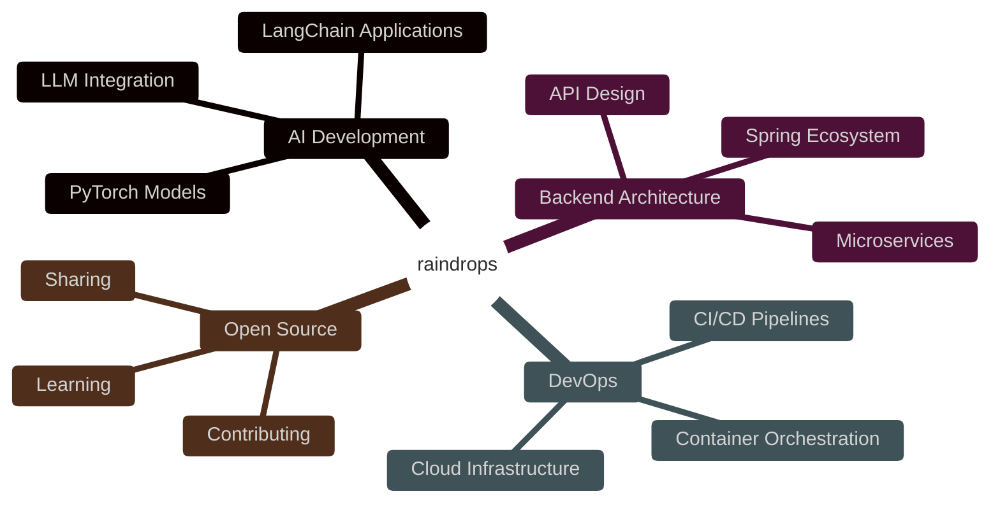

### Hi there 👋

<!--
**raindrops-0199/raindrops-0199** is a ✨ _special_ ✨ repository because its `README.md` (this file) appears on your GitHub profile.

Here are some ideas to get you started:

- 🔭 I’m currently working on ...
- 🌱 I’m currently learning ...
- 👯 I’m looking to collaborate on ...
- 🤔 I’m looking for help with ...
- 💬 Ask me about ...
- 📫 How to reach me: ...
- 😄 Pronouns: ...
- ⚡ Fun fact: ..
-->
 <!--
 
 
 
 -->

 

##  Hey, I'm raindrops-0199

##  About Me

👨‍💻 Backend Developer & AI Enthusiast from Singapore 🌏

💡 **Focused on:** Building scalable backend systems and AI-powered applications

🔧 **Tech Stack:** Java • Python • C++ | Spring • FastAPI | PyTorch • LangChain

⚡ **Daily Tools:** Docker • Kubernetes • Vim • Linux

🌱 **Currently:** Exploring LLM integration and microservices architecture

## 🛠️ Tech Arsenal

### 💻 Languages

    
    
    

### 🚀 Frameworks & Tools

    
    
    
    

### 🗄️ Databases & Infrastructure

    
    
    
    

### ⚡ Dev Tools

    
    
    

## 📊 GitHub Analytics

## 🏆 GitHub Trophies

## 🎯 Current Focus

## 🔥 What I'm Up To

🤖 **Building AI-powered applications** with LangChain and LLMs  
🏗️ **Designing scalable microservices** with Spring Boot  
📊 **Exploring ML model deployment** and optimization  
🐳 **Containerizing everything** with Docker & K8s  
🌟 **Contributing to open source** projects  

## 📫 Let's Connect

---

### 💡 Random Dev Quote

### 📈 Profile Views

